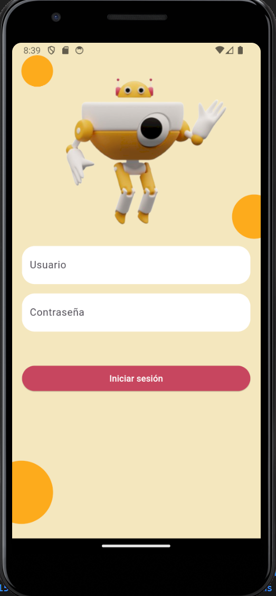
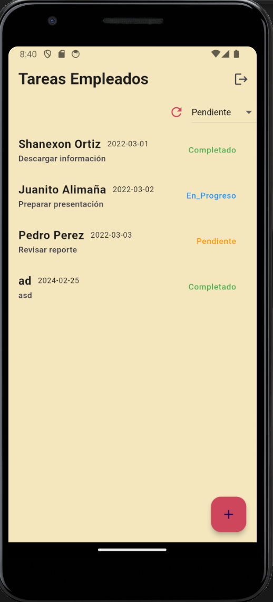
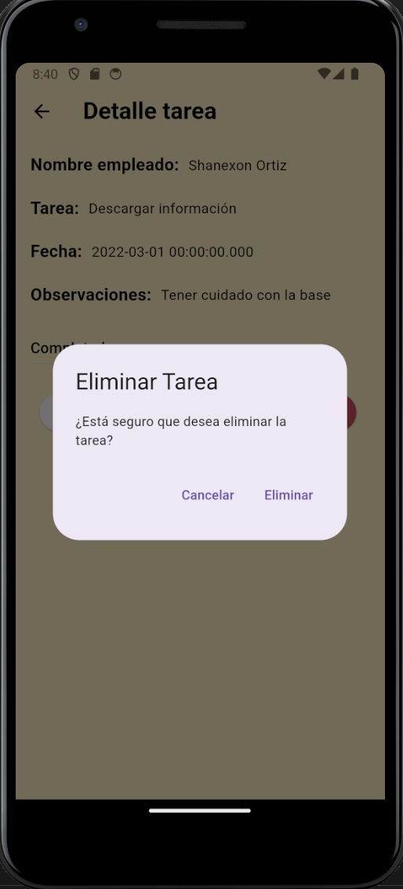
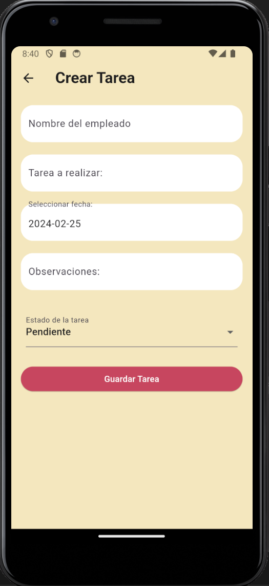

# Task EMPLOYEE APP

# Funcionamiento
La aplicación permite a los usuarios iniciar sesión con un nombre de usuario y contraseña. Una vez iniciada la sesión, los usuarios pueden ver una lista de tareas pendientes y filtrarlas por estado. También pueden cargar todas las tareas nuevamente sin filtros. Cada tarea muestra su nombre, fecha de vencimiento y estado actual.

# Gestor de Estados
La aplicación utiliza el paquete provider de Flutter como gestor de estados. provider es una forma sencilla y eficiente de administrar el estado de la aplicación, permitiendo la actualización de la interfaz de usuario cuando cambia el estado.

# Arquitectura
La arquitectura de la aplicación sigue el patrón MVC (Modelo-Vista-Controlador). Los modelos representan los datos de las tareas, las vistas son los widgets que componen la interfaz de usuario y los controladores manejan la lógica de la aplicación, como la autenticación y la gestión de tareas.

# Librerías Utilizadas
provider: ^6.1.1: Gestor de estados utilizado para administrar el estado de la aplicación de forma eficiente.
intl: ^0.19.0: Utilizada para formatear fechas y horas en diferentes formatos según la localización del usuario.
animate_do: ^3.3.3: Utilizada para añadir animaciones a los widgets y mejorar la experiencia de usuario.
flutter_screenutil: ^5.5.3+2: Utilizada para gestionar de forma sencilla los tamaños de pantalla y los espacios en la aplicación, garantizando una apariencia consistente en diferentes dispositivos.
cached_network_image: ^3.0.0: Utilizada para gestionar de forma eficiente la carga y almacenamiento en caché de imágenes desde una URL remota, mejorando el rendimiento de la aplicación al mostrar imágenes.

# Instalación
Clona este repositorio en tu máquina local.
Abre el proyecto en tu editor de código favorito.
# Ejecución
Asegúrate de tener Flutter instalado en tu sistema. Si no lo tienes, sigue las instrucciones de instalación de Flutter.
Ejecuta flutter pub get en la raíz del proyecto para instalar las dependencias.
Conecta tu dispositivo o inicia un emulador.
Ejecuta flutter run en la raíz del proyecto para lanzar la aplicación en tu dispositivo/emulador.
# Uso
Al iniciar la aplicación, se te pedirá que inicies sesión.
Utiliza el usuario # user y la contraseña # 123 para iniciar sesión.
Una vez iniciada la sesión, verás la lista de tareas pendientes.
Puedes utilizar el menú desplegable para filtrar las tareas por estado.
También puedes presionar el botón "RELOAD" para cargar todas las tareas sin filtrar.

